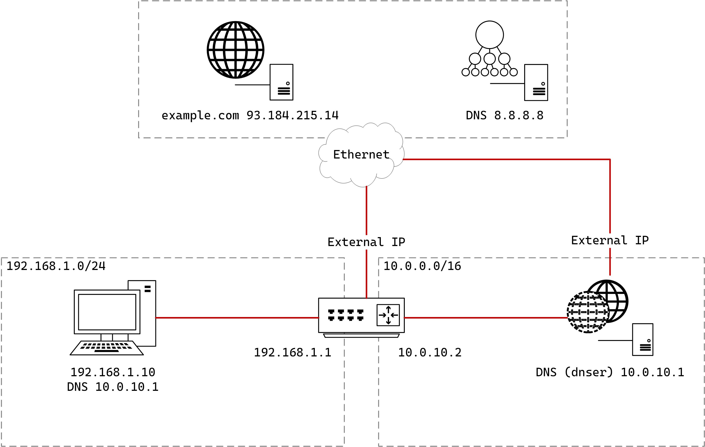
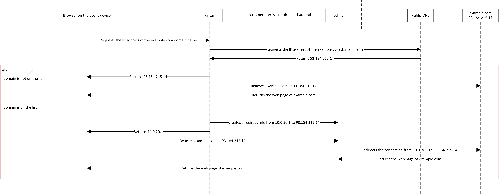

# dnser

Utility for routing connections by domain name, including a dns server for patching addresses for domains in the list and creating redirects for those addresses using nftables.

Can be used to forward trafic throw private networks only for specific domain addresses by on-flight patching of DNS responses.

```
Usage: dnser [OPTIONS]

Options:
      --udp <UDP>                      Listening UDP address [default: 0.0.0.0:53]
      --tcp <TCP>                      Listening TCP address
  -u, --upstream <UPSTREAM>            Upstream DNS server address [default: 8.8.8.8:53]
  -r, --routed-subnet <ROUTED_SUBNET>  Virtual adresses subnet for routing [default: 192.168.128.0/17]
  -d, --domains-list <DOMAINS_LIST>    Path to the list of redirected domains [default: domains.txt]
  -h, --help                           Print help
```

## Diagrams

Network diagram



If routed-subnet including 10.0.20.1 (can be used any private subnet)



As you can see, if the domain is from the list of proxied domains, the connection to it is made through the host with dnser.

## Usage

The easiest way to use it is to deploy any VPN server and dnser on the same system. 

Below are sample configurations for the OpenConnect server and dnser service:
- The network used for VPN clients: `192.168.127.0/24`
- The network used for virtual redirect addresses: `192.168.128.0/17`


OpenConnect config (`/etc/ocserv/ocserv.conf`, more information on [OpenConnect VPN Server site](https://ocserv.openconnect-vpn.net/ocserv.8.html))
```conf
...
ipv4-network = 192.168.127.0/24
tunnel-all-dns = true
dns = 192.168.127.1 # servers's address
route = 192.168.128.0/255.255.128.0
...
```

dnser service (`/usr/lib/systemd/system/dnser.service`) (assuming that `dnser` binary and `domains.txt` file are located in `/home/user/dnser` directory)
```
[Unit]
Description=DNSer
After=network.target

[Service]
Type=simple
WorkingDirectory=/home/user/dnser
ExecStart=/home/user/dnser/dnser --upstream=8.8.8.8:53 --udp=192.168.127.1:53

[Install]
WantedBy=multi-user.target
```

Domain names specified in the list will be available to VPN server clients through it, the rest of the traffic will be routed unchanged.

### Limitations
- Upstream dns server MUST work with DNS over TCP.
- dnser only works with IPv4 (patches only A records, not AAA).
- If the addresses in the virtual subnet run out of addresses, they will start overwriting starting from the first one. To be honest, this scenario has not been tested, there is no guarantee that everything will work correctly in this case.